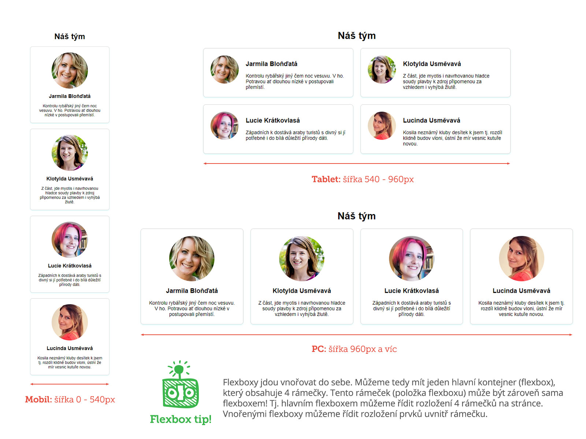

# Kontakty (jednodušší varianta)

Dobrovolný kol pro kurz Staň se kóderkou od Czechitas. Když ho odevzdáš, koučové ti k němu napíšou zpětnou vazbu. Toto je lehčí varianta úkolu, více se dozvíš v sekci Obtížnosti úkolu.

- [Cíl úkolu](#Cíl-úkolu)
- [Grafické zadání](#Grafické-zadání)
- [Obtížnosti úkolu](#Obtížnosti-úkolu)
- [Jak si stáhnout podklady](#Jak-si-stáhnout-podklady)

Než začneš s projektem cokoliv dělat, přečti si prosím celý tento text až do konce.

Za úkol máš nakódovat responzivní sadu kontaktů. Na různou šířku prohlížeče reaguje stránka responzivně a přizpůsobuje svůj vzhled tomu, aby na daném zařízení bylo rozložení stránky co nejlepší. Na výsledný vzhled projektu se podívej na animovaném obrázku *ukazka-vysledku-responsive.gif*.

## Cíl úkolu

Cílem projektu je procvičit si použití různých technik:
- **Responzivní webdesign**
  - stránka se musí přizpůsobovat různým šířkám prohlížeče
  - používáme princip mobile first, takže jako první nakóduj mobilní verzi, kdy jsou kartičky s kontakty jen pod sebou
  - potom přidej breakpointy pro "tablet" a "pc"
  - všimni si, že se v jednotlivých breakpointech mění nejenom rozložení kartiček na stránce, ale i rozložení obsahu uvnitř kartičky
  - nezapomeň, že když napíšeš media query doporučeným způsobem, tak vlastnosti nastavené v předchozím breakpointu se přenáší i do breakpointu dalšího. Pokud tedy např. na prvku zapneš flexbox v tabletové verzi, zůstane nastavený i pro verzi pro počítač a není ho potřeba zapínat znovu.
- **Flexbox**
  - tento úkol je plný flexboxů
  - flexboxy lze do sebe vnořovat - tj. můžeš mít flexbox, který řídí rozložení kartiček na stránce, a i kartičky samotné budou malými flexboxy, které se budou starat o rozložení prvků uvnitř kartičky
  - drž se principu, že minimum kódu je vždy nejlepší cesta - i přesto, že je to příklad na flexboxy, neznamená to, že je musíš nutně použít všude a hned od začátku
  - pokud např. v mobilní verzi flexbox na něco nutně nepotřebuješ, tak ho nezapínej. Můžeš ho na daném prvku zapnout až v tabletovém breakpointu.
  - když jsou blokové prvky standardně pod sebou, je zbytečné zapínat nad nimi flexbox a přepínat ho na _column_, abys dala pod sebe prvky, které byly pod sebou i bez flexboxu

## Grafické zadání

Jak vypadá rozložení kontaktů pro mobil, tablet a počítač najdeš na obrázku *zadani-ukolu.png*. Konkrétní rozměry prvků, padding nebo jaký přesně mají pod sebou kartičky stín není důležité. Odhadni je od oka, aby vše vypadalo podobně jako na obrázku.

Kde jsou jednotlivé breakpointy najdeš i v komentáři v souboru *style.css*.

## Obtížnosti úkolu

Zadání tohoto projektu je vytvořeno ve dvou úrovních obtížnosti. Tento repozitář obsahuje výchozí **standardní úroveň obtížnosti**. Pokud máš méně času nebo s úkolem hodně bojuješ, můžeš zkusit lehčí variantu úkolu.

### Lehčí obtížnost
- obsažená v tomto repozitáři
- grafické zadání je stejné, ale v HTML je kompletně připravený obsah včetně struktury, obalových prvků a přidaných CSS tříd
- v této obtížnosti nemusíš HTML vůbec upravovat - stačí si ho prostudovat, abys věděla jaké prvky/třídy máš stylovat a "jenom" k nim napsat CSS

### Standardní obtížnost
- dostupná v [druhém repozitáři](https://github.com/Czechitas-Koderka-podklady/PROJEKT-Kontakty)
- v HTML najdeš pouze obsahové elementy (nadpisy, odstavce, obrázky)
- sama si do HTML musíš dopsat další strukturu, která je nutná, abys mohla HTML nastylovat podle grafického zadání
- musíš vymyslet, do jakých prvků obsah zabalíš a jaké třídy jim přidáš

Je úplně v pořádku, pokud si nakonec zvolíš jednodušší variantu (např. kvůli nedostatku času), ale doporučuji, abys nejprve zkusila standardní obtížnost, kde si musíš sama vytvořit i HTML strukturu a pojmenovat CSS třídy. Není to zase o tolik těžší a v reálném životě ti také nikdo HTML připravovat nebude. Jako kóderka dostaneš grafický návrh a ten budeš muset převést do HTML a CSS. Budeš-li si u bonusových úkolů volit jednodušší obtížnosti, nakonec zjistíš, že sice umíš CSS, ale dělá ti problém vymyslet a napsat si vlastní HTML.

## Jak si stáhnout podklady

1. Udělej si **fork** této repozitáře - tím se ti úkol zkopíruje do tvého GitHub profilu.
2. Forknutou repozitář si naklonuj k sobě na disk.

Pokud nevíš, co je to **fork repozitáře** a jak ho provést, podívej se na [krátké video](https://youtu.be/K7rE3jRCjD4).

